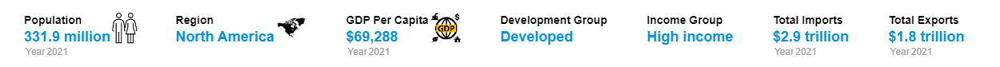
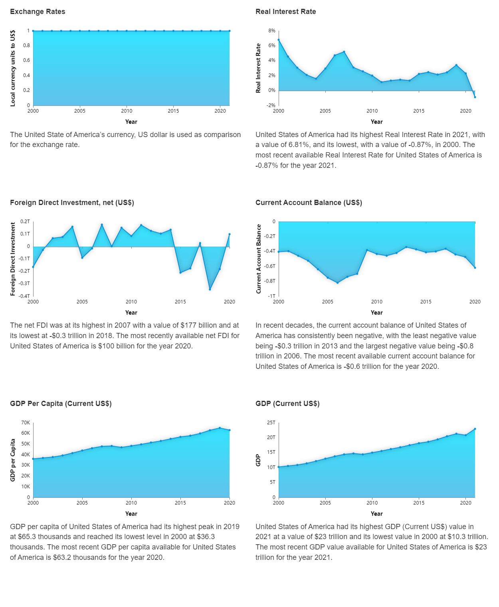
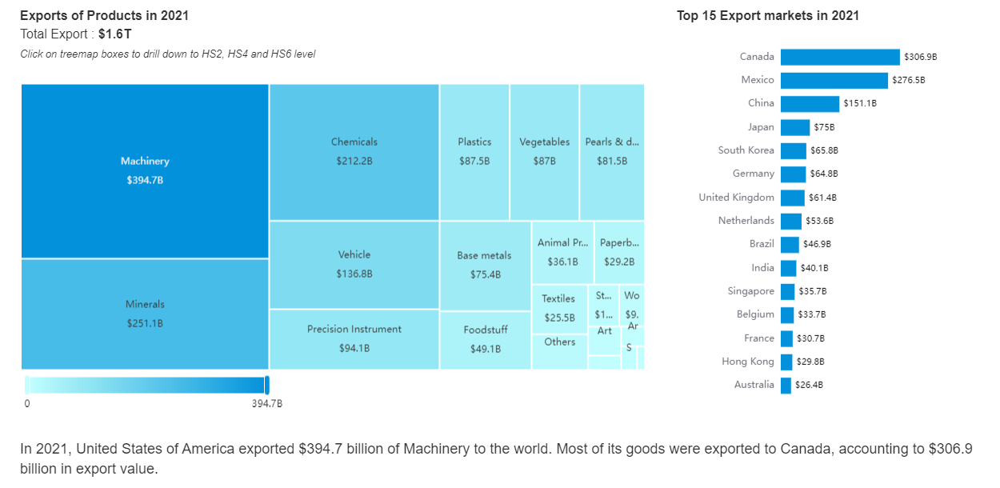
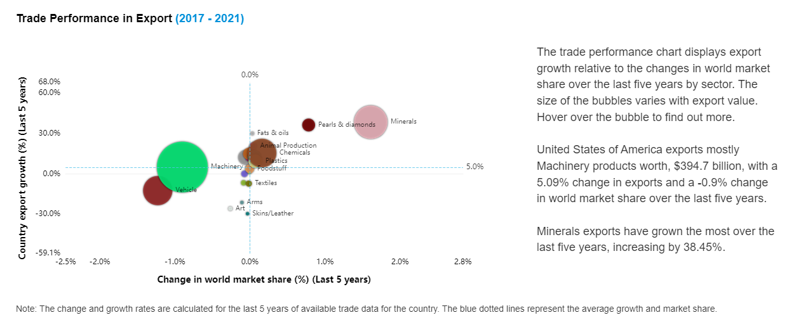
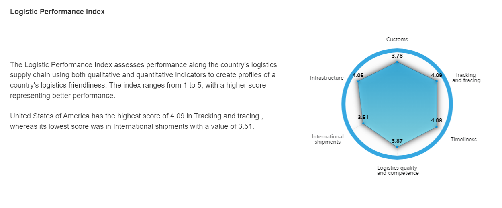
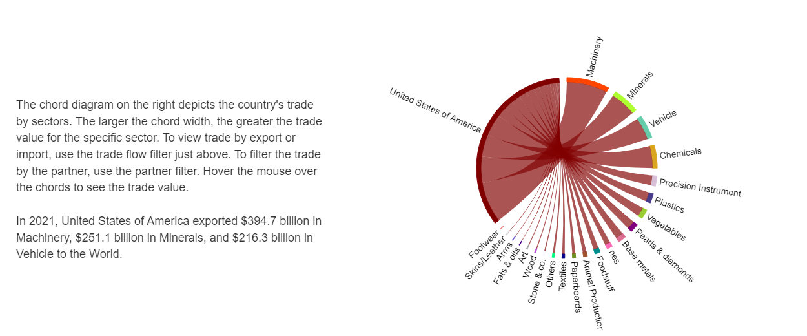
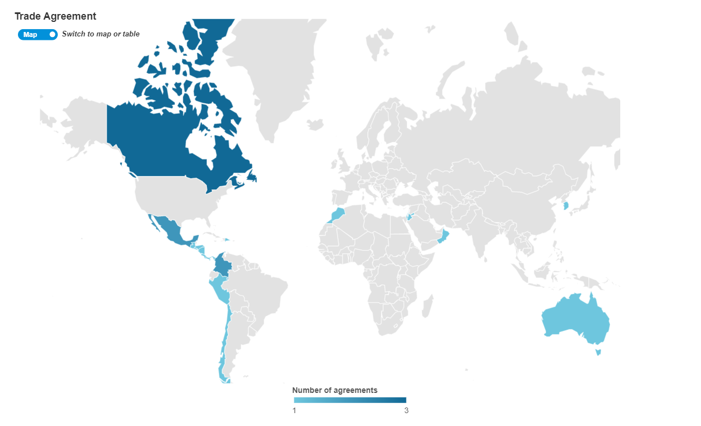
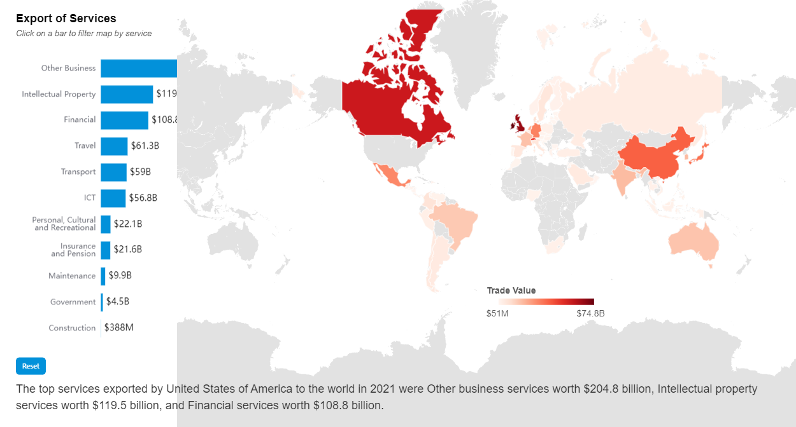
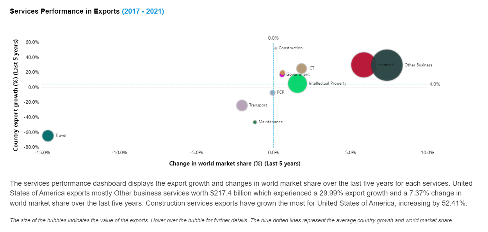
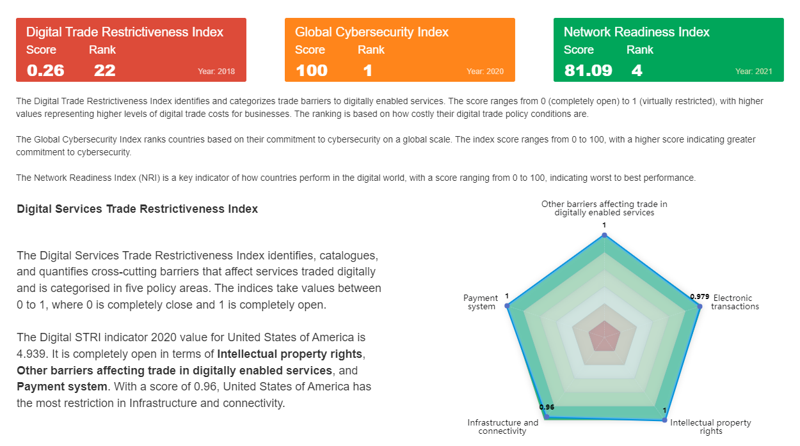

\newpage
\pagenumbering{arabic} 

```{r setup, include=FALSE}
# options(tinytex.verbose = TRUE)
knitr::opts_chunk$set( echo = FALSE, fig.retina = 2)
```


\newpage

```{r, figures-side1,  out.width="100%",results='asis', echo=FALSE}
 # plot_1()

cat("  \n") 

cat("  \n") 

cat("  \n\\pagebreak\n") 
knitr::include_graphics("ReportImg/titleti.png")

cat("  \n") 

cat("  \n") 
if(nrow(params$LPI) > 0)
{

}
cat("  \n\\pagebreak\n")

knitr::include_graphics("ReportImg/bilateralhead.png")

cat("  \n") 
if(nrow(params$agreement) > 0)
{

}
cat("  \n\\pagebreak\n") 

if(nrow(params$services) > 0)
{
knitr::include_graphics("ReportImg/tradeinservicestitle.png")

}
cat("  \n") 
if(nrow(params$serviceperf) > 0)
{

}
cat("  \n\\pagebreak\n") 

knitr::include_graphics("ReportImg/digitalheader.png")

cat("  \n") 
if(nrow(params$tradefacilitation) > 0)
{
knitr::include_graphics("ReportImg/tradefacilitation.png")
}


# params$plot_1
# params$plot_2
```

```{r figures-side2,  out.width = "100%", echo=FALSE, results = "asis"}
cat("\\newgeometry{left=0.02cm,right=0cm,top=0.03cm,bottom=0cm}")

cat("\\restoregeometry")
```